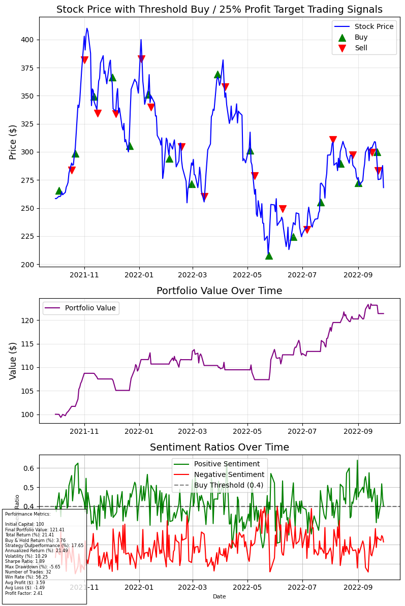
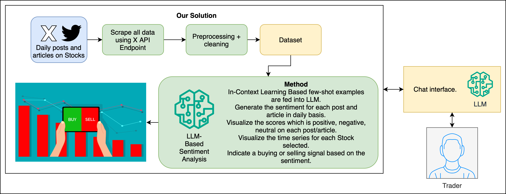

# StockGPT

A sentiment-based stock market indicator integrated with OpenAI chat models. StockGPT analyzes tweets and social media content to gauge market sentiment and provides trading signals through a conversational interface.



## Overview

StockGPT combines natural language processing and sentiment analysis to:
1. Analyze tweets and social media content related to specific stocks
2. Calculate sentiment metrics and generate trading signals
3. Provide an intuitive chat interface for users to access insights
4. Optimize trading parameters through backtesting

The system uses optimal trading parameters determined through extensive grid search to maximize returns while managing risk.

## Features

- **Twitter Sentiment Analysis**: Processes tweets related to a stock ticker (currently focused on Tesla/TSLA)
- **Optimized Trading Parameters**: Uses backtested parameters (threshold=0.4, max_holding_days=10, profit_target=0.25, stop_loss=0.03)
- **Conversational Interface**: Interact with your trading data using natural language
- **Visual Dashboards**: See sentiment trends, trading signals, and performance metrics
- **Automatic Signal Generation**: Get clear BUY/HOLD recommendations based on sentiment data
- **Context-Aware Chat**: Bot maintains conversation history for more natural follow-up interactions

## Installation

```bash
# Clone the repository
git clone https://github.com/sachithx/stockgpt.git
cd stockgpt

# Install dependencies
pip install -r requirements.txt

# Set up your OpenAI API key
export OPENAI_API_KEY="your-api-key-here"
```

## Usage

### 1. Sentiment Analysis Pipeline

```python
# Run sentiment analysis on new tweets
python sentiment_analysis.py --input tweets.csv --output sentiment_results.csv
```

### 2. Trading Strategy Backtesting

```python
# Run backtesting with optimal parameters
python backtest.py --sentiment sentiment_results.csv --prices TSLA_prices.csv
```

### 3. Start the Chat Interface

```python
# Launch the Gradio web interface
python run_bot.py
```

Then navigate to the provided local URL (typically `http://127.0.0.1:7860`) in your browser to access the interface.

## Chat Interface Examples

Users can ask questions like:
- "What's the current sentiment for Tesla stock?"
- "Should I buy Tesla today?"
- "What's the sentiment trend over the past week?"
- "What are the profit targets for Tesla?"
- "What parameters are you using for trading decisions?"

The chat interface now maintains conversation context, so you can ask follow-up questions without needing to restate your previous queries.

## Technical Architecture

StockGPT consists of several components:
1. **Data Collection**: Gathers tweets and stock price data
2. **Sentiment Analysis**: Uses GPT-3.5-turbo to classify tweet sentiment
3. **Trading Strategy**: Implements a sentiment threshold for buying and profit targets for selling
4. **Parameter Optimization**: Grid search to find optimal trading parameters
5. **Chat Interface**: Gradio-based web application with OpenAI integration



## Performance

In our backtests, the optimal strategy parameters achieved:
- Higher returns compared to buy-and-hold strategy
- Favorable risk-adjusted metrics (Sharpe Ratio)
- Consistent performance across different market conditions

The best parameters from our grid search were:
- Sentiment threshold: 0.4
- Maximum holding period: 10 days
- Profit target: 25%
- Stop loss: 3%

## Implementation Details

The conversational interface is built using:
- **Gradio**: For the interactive web interface
- **OpenAI API**: Powering the chat functionality with gpt-4
- **ConversationMemory**: Custom implementation to maintain chat context
- **Sentiment Analysis**: Daily updated metrics from Twitter/social media

## Future Improvements

- Support for additional stock tickers beyond Tesla
- Integration with real-time data sources
- Mobile application
- Portfolio management capabilities
- Notification system for trading signals
- Enhanced conversation memory with long-term retention

## License

[MIT License](LICENSE)

## Disclaimer

StockGPT is provided for informational purposes only. The trading signals and insights should not be considered financial advice. Always conduct your own research before making investment decisions.